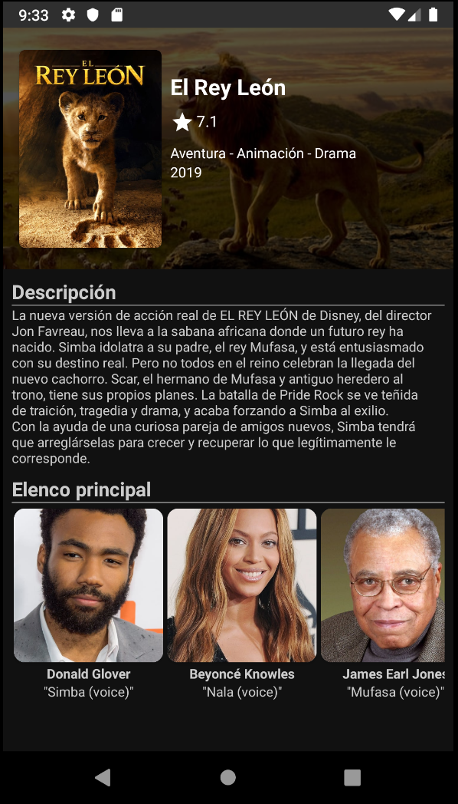

# The Movie App

This is a public Android project created to use the Movie Data Base and the consumption of its API. The objective is to show the most popular, upcoming and uprated movies and tv shows. This project was created using MVC.

      

## Getting Started

### Prerequisites

You need a API Key from https://www.themoviedb.org/, and set it in the string Utilities/References -> TMDB_API_KEY

### Used tools

* Volley
* Glide
* MVC

## Authors

* **Miguel Angel Ochoa** - (https://github.com/developmadd)

## Acknowledgments

* TMDB

